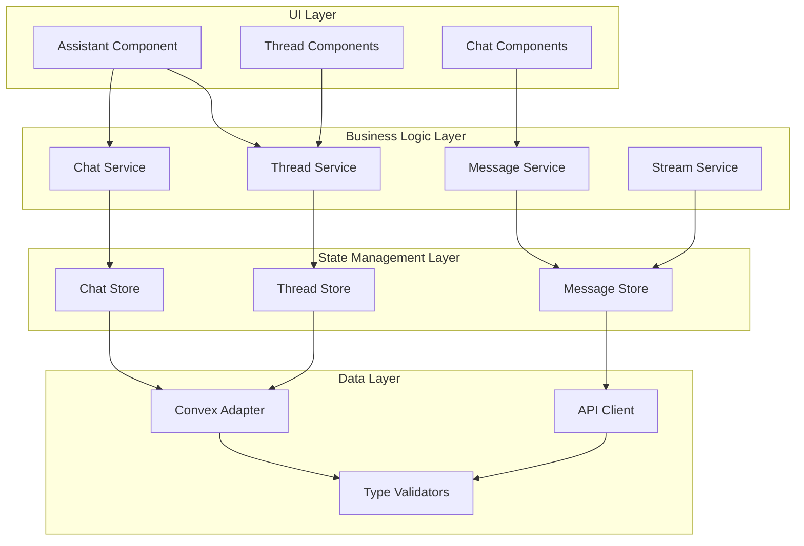

# Chat Feature Refactoring Design Document

## Overview

This design document outlines a comprehensive refactoring of the chat feature to improve maintainability, performance, and developer experience. The refactoring follows a test-first approach, ensuring existing functionality is preserved while modernizing the architecture.

## Architecture

### Current Architecture Analysis

The existing chat feature has several architectural challenges:

1. **Monolithic Provider**: `ConvexExternalRuntimeProvider` handles too many responsibilities
2. **Complex State Management**: Thread context manages both UI state and business logic
3. **Tightly Coupled Components**: Hard to test and modify independently
4. **Inconsistent Error Handling**: Error handling scattered throughout the codebase
5. **Performance Issues**: Excessive re-renders and inefficient state updates

### Proposed Architecture



## Components and Interfaces

### 1. Service Layer

#### ChatService
```typescript
interface ChatService {
  // Message operations
  sendMessage(content: MessageContent, threadId: string): Promise<void>
  editMessage(messageId: string, content: MessageContent): Promise<void>
  deleteMessage(messageId: string): Promise<void>
  
  // Streaming operations
  streamMessage(prompt: string, threadId: string, options?: StreamOptions): Promise<void>
  cancelStream(): void
  
  // Thread operations
  createThread(title?: string): Promise<string>
  switchThread(threadId: string): Promise<void>
  deleteThread(threadId: string): Promise<void>
}
```

#### MessageService
```typescript
interface MessageService {
  validateMessage(message: unknown): message is ThreadMessage
  convertConvexMessage(convexMessage: ConvexMessage): ThreadMessage
  optimisticUpdate(message: ThreadMessage, threadId: string): void
  rollbackOptimisticUpdate(messageId: string, threadId: string): void
}
```

#### StreamService
```typescript
interface StreamService {
  startStream(config: StreamConfig): Promise<ReadableStream>
  handleStreamChunk(chunk: StreamChunk): void
  handleStreamError(error: Error): void
  handleStreamComplete(): void
  abortStream(): void
}
```

### 2. State Management Layer

#### Store Architecture
Using Zustand for predictable state management:

```typescript
interface ChatStore {
  // State
  messages: Map<string, ThreadMessage[]>
  currentThreadId: string
  isStreaming: boolean
  streamingMessageId: string | null
  
  // Actions
  setMessages: (threadId: string, messages: ThreadMessage[]) => void
  addMessage: (threadId: string, message: ThreadMessage) => void
  updateMessage: (threadId: string, messageId: string, updates: Partial<ThreadMessage>) => void
  removeMessage: (threadId: string, messageId: string) => void
  setCurrentThread: (threadId: string) => void
  setStreamingState: (isStreaming: boolean, messageId?: string) => void
}
```

### 3. Data Layer

#### Type System
```typescript
// Core message types
interface ThreadMessage {
  id: string
  role: 'user' | 'assistant' | 'system'
  content: MessageContent[]
  createdAt: Date
  updatedAt?: Date
  attachments?: Attachment[]
  metadata?: MessageMetadata
}

interface MessageContent {
  type: 'text' | 'image' | 'file'
  text?: string
  image?: string
  file?: FileReference
}

// Validation schemas
const ThreadMessageSchema = z.object({
  id: z.string().min(1),
  role: z.enum(['user', 'assistant', 'system']),
  content: z.array(MessageContentSchema).min(1),
  createdAt: z.date(),
  updatedAt: z.date().optional(),
  attachments: z.array(AttachmentSchema).optional(),
  metadata: MessageMetadataSchema.optional()
})
```

#### Error Handling System
```typescript
// Centralized error handling
class ChatError extends Error {
  constructor(
    message: string,
    public code: ChatErrorCode,
    public context?: Record<string, unknown>
  ) {
    super(message)
    this.name = 'ChatError'
  }
}

enum ChatErrorCode {
  NETWORK_ERROR = 'NETWORK_ERROR',
  VALIDATION_ERROR = 'VALIDATION_ERROR',
  STREAM_ERROR = 'STREAM_ERROR',
  THREAD_NOT_FOUND = 'THREAD_NOT_FOUND',
  MESSAGE_NOT_FOUND = 'MESSAGE_NOT_FOUND'
}

interface ErrorHandler {
  handleError(error: ChatError): void
  recoverFromError(error: ChatError): Promise<void>
}
```

## Data Models

### Message Data Model
```typescript
interface ThreadMessage {
  id: string
  role: MessageRole
  content: MessageContent[]
  createdAt: Date
  updatedAt?: Date
  attachments?: Attachment[]
  metadata?: {
    isOptimistic?: boolean
    streamingState?: 'pending' | 'streaming' | 'complete' | 'error'
    errorMessage?: string
    retryCount?: number
  }
}
```

### Thread Data Model
```typescript
interface Thread {
  id: string
  title: string
  createdAt: Date
  updatedAt: Date
  status: 'active' | 'archived' | 'deleted'
  messageCount: number
  lastMessageAt?: Date
  metadata?: {
    model: string
    parentThreadId?: string
    branchPoint?: number
  }
}
```

### Stream Data Model
```typescript
interface StreamState {
  isActive: boolean
  messageId: string | null
  threadId: string | null
  abortController: AbortController | null
  retryCount: number
  lastError?: Error
}
```

## Error Handling

### Error Classification
1. **Network Errors**: Connection issues, timeouts, server errors
2. **Validation Errors**: Invalid message format, missing required fields
3. **Stream Errors**: Streaming interruptions, malformed chunks
4. **State Errors**: Invalid state transitions, race conditions
5. **User Errors**: Invalid operations, permission issues

### Error Recovery Strategies
```typescript
interface ErrorRecoveryStrategy {
  canRecover(error: ChatError): boolean
  recover(error: ChatError): Promise<void>
}

class NetworkErrorRecovery implements ErrorRecoveryStrategy {
  canRecover(error: ChatError): boolean {
    return error.code === ChatErrorCode.NETWORK_ERROR
  }
  
  async recover(error: ChatError): Promise<void> {
    // Implement exponential backoff retry logic
  }
}
```

### User-Facing Error Messages
```typescript
const ERROR_MESSAGES = {
  [ChatErrorCode.NETWORK_ERROR]: 'Connection lost. Retrying...',
  [ChatErrorCode.STREAM_ERROR]: 'Message streaming interrupted. Click to retry.',
  [ChatErrorCode.VALIDATION_ERROR]: 'Invalid message format. Please try again.',
  [ChatErrorCode.THREAD_NOT_FOUND]: 'Thread not found. Redirecting to main chat.',
  [ChatErrorCode.MESSAGE_NOT_FOUND]: 'Message not found. Refreshing conversation.'
} as const
```

## Testing Strategy

### 1. Test Structure
```
tests/
├── unit/
│   ├── services/
│   ├── stores/
│   ├── utils/
│   └── components/
├── integration/
│   ├── chat-flow/
│   ├── thread-management/
│   └── error-handling/
└── e2e/
    ├── message-sending/
    ├── thread-switching/
    └── error-scenarios/
```

### 2. Testing Approach

#### Unit Tests
- **Services**: Test business logic in isolation
- **Stores**: Test state management and actions
- **Components**: Test UI behavior with mocked dependencies
- **Utilities**: Test pure functions and helpers

#### Integration Tests
- **Chat Flow**: Test complete message sending flow
- **Thread Management**: Test thread operations end-to-end
- **Error Handling**: Test error scenarios and recovery

#### End-to-End Tests
- **User Workflows**: Test complete user journeys
- **Performance**: Test under load and stress conditions
- **Cross-browser**: Test compatibility across browsers

### 3. Test Utilities
```typescript
// Test factories
export const createMockMessage = (overrides?: Partial<ThreadMessage>): ThreadMessage => ({
  id: generateId(),
  role: 'user',
  content: [{ type: 'text', text: 'Test message' }],
  createdAt: new Date(),
  ...overrides
})

// Test helpers
export const renderChatComponent = (props?: Partial<ChatProps>) => {
  return render(
    <TestProviders>
      <Chat {...defaultProps} {...props} />
    </TestProviders>
  )
}

// Mock services
export const createMockChatService = (): MockedObject<ChatService> => ({
  sendMessage: vi.fn(),
  editMessage: vi.fn(),
  deleteMessage: vi.fn(),
  streamMessage: vi.fn(),
  cancelStream: vi.fn(),
  createThread: vi.fn(),
  switchThread: vi.fn(),
  deleteThread: vi.fn()
})
```

## Performance Optimizations

### 1. State Management Optimizations
- **Selective Re-renders**: Use fine-grained subscriptions
- **Memoization**: Cache expensive computations
- **Batched Updates**: Group related state changes

### 2. Streaming Optimizations
- **Adaptive Throttling**: Adjust update frequency based on performance
- **Chunk Batching**: Process multiple chunks together
- **Memory Management**: Clean up completed streams

### 3. Component Optimizations
- **React.memo**: Prevent unnecessary re-renders
- **useMemo/useCallback**: Cache expensive operations
- **Lazy Loading**: Load components on demand

### 4. Data Optimizations
- **Message Pagination**: Load messages incrementally
- **Thread Virtualization**: Render only visible threads
- **Efficient Data Structures**: Use Maps for O(1) lookups

## Migration Strategy

### Phase 1: Test Coverage (Requirements 1 & 8)
1. Create comprehensive test suite for existing functionality
2. Set up testing infrastructure and utilities
3. Achieve 90%+ code coverage before refactoring

### Phase 2: Service Layer (Requirements 2 & 7)
1. Extract business logic into service classes
2. Implement proper TypeScript types
3. Add comprehensive error handling

### Phase 3: State Management (Requirements 5 & 6)
1. Replace complex context with Zustand stores
2. Implement predictable state updates
3. Add debugging and logging capabilities

### Phase 4: Component Refactoring (Requirements 3 & 4)
1. Simplify component responsibilities
2. Improve error boundaries and user feedback
3. Optimize performance and rendering

### Phase 5: Documentation & DX (Requirement 9)
1. Add comprehensive documentation
2. Improve debugging tools
3. Create development guides

## Implementation Considerations

### Backward Compatibility
- Maintain existing API contracts during transition
- Use feature flags for gradual rollout
- Provide migration path for existing code

### Performance Monitoring
- Add performance metrics and monitoring
- Track key user experience indicators
- Monitor error rates and recovery success

### Developer Experience
- Provide clear error messages and debugging info
- Create comprehensive documentation
- Add development tools and utilities