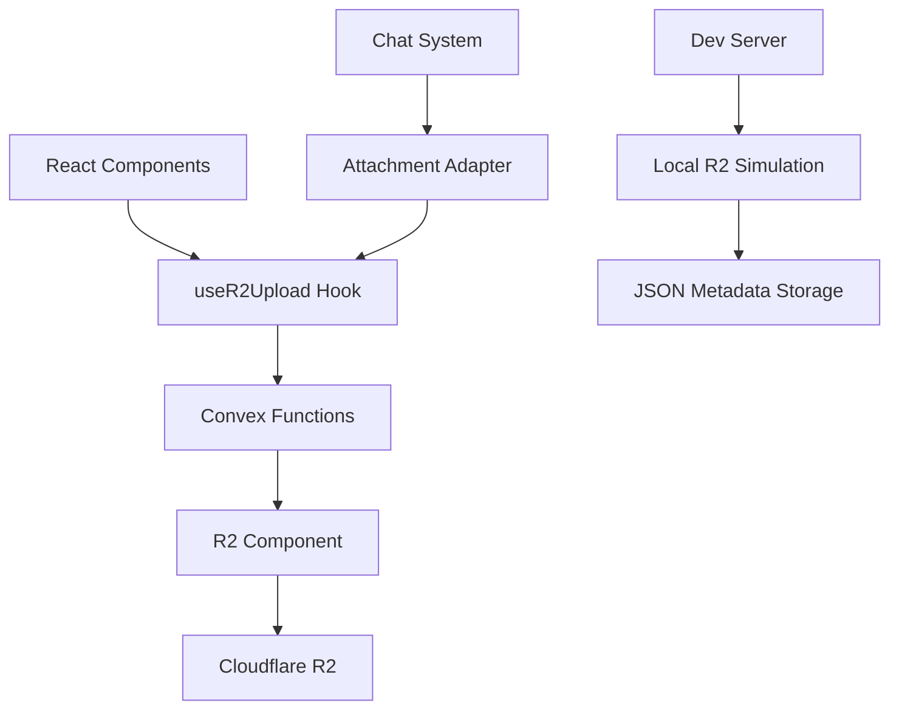

# R2 Integration Documentation

## Overview

This document describes the Cloudflare R2 integration for the AI Chat application. The integration provides file storage capabilities using Cloudflare R2 as an alternative to Convex's built-in storage.

## Current Status

### ✅ Completed

- **R2 Development Server**: Node.js-based development server for local R2 simulation
- **R2 Configuration**: Convex R2 component configuration
- **Actual R2 Integration**: Real R2 API calls implemented using @convex-dev/r2
- **File Upload Functions**: Working R2 functions with proper API integration
- **React Hooks**: `useR2Upload` hook with multiple upload methods
- **UI Components**: `R2FileUpload` component with real R2 upload options
- **Attachment Adapter**: R2-compatible attachment adapter for chat
- **Upload URL Generation**: Real R2 signed URLs for file uploads
- **File Storage**: Direct storage to R2 with metadata sync
- **File Retrieval**: R2 file URL generation with expiration

### 🚧 Future Enhancements

- **File Deletion**: Delete operations (API method needs verification)
- **File Listing**: Bulk file listing with pagination
- **Advanced Metadata**: Extended file metadata and search capabilities

## Architecture



## File Structure

```
convex/
├── files/
│   └── functions.ts          # R2 file handling functions
├── r2.config.ts             # R2 component configuration
└── convex.config.ts         # Main Convex config with R2

src/features/chat/
├── hooks/
│   └── useR2Upload.ts       # React hook for R2 uploads
├── components/
│   ├── adapter/
│   │   └── r2-attachment-adapter.ts  # R2 attachment adapter
│   └── R2FileUpload.tsx     # Upload UI component
└── providers/
    └── convex-external-runtime-provider.tsx  # Chat runtime with R2

scripts/
├── cloudflare-r2-dev-server.js  # Local R2 development server
└── sync-env-to-convex.js        # Environment sync script

docs/
└── R2_INTEGRATION.md        # This documentation
```

## Configuration

### Environment Variables

Required environment variables for R2 integration:

```bash
# Cloudflare R2 Configuration
R2_ACCESS_KEY_ID=your_access_key_id
R2_SECRET_ACCESS_KEY=your_secret_access_key
R2_ENDPOINT=https://your-account-id.r2.cloudflarestorage.com
R2_BUCKET=your-bucket-name

# Development Server
R2_DEV_SERVER_PORT=8787
```

### Convex Configuration

The R2 component is configured in `convex/convex.config.ts`:

```typescript
import { defineApp } from "convex/server";
import r2 from "@convex-dev/r2/convex.config";

const app = defineApp();
app.use(r2, {
    bucket: process.env.R2_BUCKET!,
});

export default app;
```

## Development Server

### Starting the R2 Dev Server

```bash
# Start the development server
node scripts/cloudflare-r2-dev-server.js

# Or with custom port
node scripts/cloudflare-r2-dev-server.js --port 8080
```

The development server provides:

- **File Upload**: `PUT /{key}` - Upload files with custom keys
- **File Download**: `GET /{key}` - Download files by key
- **File Listing**: `GET /` - List all uploaded files
- **Metadata Storage**: JSON-based metadata storage in `uploads/` directory

### Server Features

- **User-specific uploads**: Files organized by user ID (`uploads/{userId}/`)
- **Metadata tracking**: File size, content type, upload timestamp
- **CORS support**: Configured for local development
- **JSON storage**: No database dependencies, uses JSON files

## API Functions

### Upload Functions

```typescript
// Generate R2 upload URL (placeholder)
const result = await generateR2UploadUrl({
    sessionToken: "user_session_token",
    filename: "document.pdf",
});

// Store file from URL
const stored = await storeFileFromUrl({
    url: "https://example.com/file.pdf",
    filename: "document.pdf",
    mimeType: "application/pdf",
    sessionToken: "user_session_token",
});
```

### File Management

```typescript
// Get file URL
const url = await getR2FileUrl({
    key: "uploads/user123/1234567890-abc123.pdf",
    sessionToken: "user_session_token",
    expiresIn: 3600, // Optional expiration in seconds
});

// Delete file
await deleteR2File({
    key: "uploads/user123/1234567890-abc123.pdf",
    sessionToken: "user_session_token",
});

// List user files
const files = await listUserR2Files({
    sessionToken: "user_session_token",
    limit: 50,
});
```

## React Integration

### Using the Upload Hook

```typescript
import { useR2Upload } from "@/features/chat/hooks/useR2Upload";

function MyComponent() {
    const {
        uploadFile,           // Fallback to existing chat system
        uploadWithR2Hook,     // Official R2 component hook
        uploadWithCustomUrl,  // Manual R2 upload with custom URL
        uploadFromUrl         // Upload from external URL
    } = useR2Upload({
        sessionToken: "user_session_token"
    });

    const handleStandardUpload = async (file: File) => {
        try {
            const result = await uploadFile(file);
            console.log("Standard upload:", result);
        } catch (error) {
            console.error("Upload failed:", error);
        }
    };

    const handleR2Upload = async (file: File) => {
        try {
            const result = await uploadWithR2Hook(file);
            console.log("R2 upload:", result);
        } catch (error) {
            console.error("R2 upload failed:", error);
        }
    };

    const handleCustomR2Upload = async (file: File) => {
        try {
            const result = await uploadWithCustomUrl(file);
            console.log("Custom R2 upload:", result);
        } catch (error) {
            console.error("Custom R2 upload failed:", error);
        }
    };

    return (
        <div>
            <input type="file" onChange={(e) => {
                const file = e.target.files?.[0];
                if (file) handleStandardUpload(file);
            }} />
            <input type="file" onChange={(e) => {
                const file = e.target.files?.[0];
                if (file) handleR2Upload(file);
            }} />
            <input type="file" onChange={(e) => {
                const file = e.target.files?.[0];
                if (file) handleCustomR2Upload(file);
            }} />
        </div>
    );
}
```

### Upload Component

```typescript
import R2FileUpload from "@/features/chat/components/R2FileUpload";

function ChatInterface() {
    return (
        <R2FileUpload
            sessionToken="user_session_token"
            onFileUploaded={(result) => {
                console.log("File uploaded:", result);
            }}
        />
    );
}
```

## Chat Integration

The R2 system integrates with the chat interface through the attachment adapter:

```typescript
const attachmentAdapter = new R2AttachmentAdapter({
    sessionToken: sessionData.session.token,
    threadId: threadId,
    model: model,
    uploadFileAction: uploadFileForChat,
    deleteFileAction: deleteFileFromChat,
});
```

## File Organization

Files are organized in R2 with the following structure:

```
uploads/
├── {userId}/
│   ├── {timestamp}-{randomId}.{extension}
│   ├── 1703123456789-abc123def.pdf
│   └── 1703123567890-xyz789ghi.jpg
└── metadata/
    └── {userId}.json  # User file metadata (dev server only)
```

## Security

### Authentication

- All R2 functions require a valid `sessionToken`
- Session validation through `internal.betterAuth.getSession`
- User-specific file access controls

### Rate Limiting

- File uploads are rate-limited per user
- Uses the same rate limiting system as chat messages
- Configurable limits in `lib/rateLimiter`

### File Access

- Files are organized by user ID
- Users can only access their own files
- Signed URLs with expiration for secure access

## Next Steps

### Immediate (Required for Full R2 Integration)

1. **Implement Actual R2 API Calls**

    - Replace placeholder functions with real R2 API calls
    - Use proper `@convex-dev/r2` component methods
    - Implement signed URL generation

2. **Fix TypeScript Errors**

    - Resolve R2 component API compatibility issues
    - Update function signatures to match R2 component

3. **Metadata Synchronization**
    - Implement proper R2 metadata sync callbacks
    - Store file metadata in Convex database
    - Handle upload completion events

### Future Enhancements

1. **Advanced Features**

    - File versioning and history
    - Bulk upload operations
    - File sharing and permissions
    - Image resizing and optimization

2. **Performance Optimizations**

    - Multipart uploads for large files
    - Upload progress tracking
    - Resumable uploads
    - CDN integration

3. **Monitoring and Analytics**
    - Upload success/failure metrics
    - Storage usage tracking
    - Performance monitoring
    - Cost optimization

## Troubleshooting

### Common Issues

1. **Upload Fails with "Unauthorized"**

    - Check session token validity
    - Verify user authentication
    - Ensure rate limits aren't exceeded

2. **Dev Server Not Starting**

    - Check port availability
    - Verify Node.js version compatibility
    - Ensure required directories exist

3. **Files Not Appearing**
    - Check file key format
    - Verify user ID in file path
    - Check dev server logs

### Debug Mode

Enable debug logging by setting:

```bash
DEBUG=r2:*
```

This will show detailed logs for R2 operations and help identify issues.

## Contributing

When working on R2 integration:

1. **Test with Dev Server**: Always test locally with the development server first
2. **Update Documentation**: Keep this documentation updated with changes
3. **Handle Errors Gracefully**: Implement proper error handling and user feedback
4. **Follow Security Practices**: Validate all inputs and maintain user access controls

## References

- [Convex R2 Component Documentation](https://docs.convex.dev/components/r2)
- [Cloudflare R2 API Documentation](https://developers.cloudflare.com/r2/api/)
- [Assistant UI Attachment Documentation](https://docs.assistant-ui.com/)
