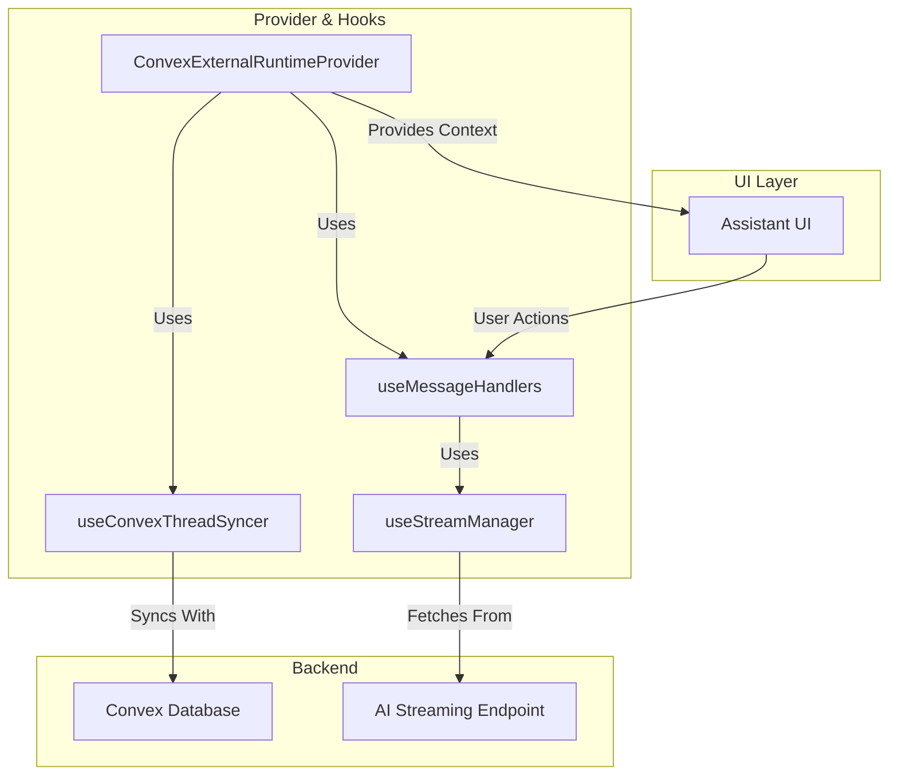

# System Patterns

This document describes the key architectural patterns and design decisions in the AI Chat App.

## Backend Architecture: Convex Serverless Platform

The application uses Convex as its comprehensive serverless backend platform, providing:

### Database & Real-time Sync

- **Real-time Database**: Transactional database with reactive queries that automatically update UI
- **Schema Management**: Type-safe schema definitions with migrations support
- **Indexing Strategy**: Optimized indexes for thread searches, user queries, and message retrieval
- **Data Relationships**: Complex relationships between users, threads, messages, pins, and feedback

### Serverless Functions Architecture

- **Queries**: Read-only functions for data fetching (e.g., `getThreads`, `getMessages`)
- **Mutations**: Write operations for data changes (e.g., `sendMessage`, `pinThread`, `updateThreadOrder`)
- **Actions**: Side-effect operations for external API calls (LLM interactions, email sending)
- **HTTP Actions**: Public API endpoints (e.g., `/convex-http/chat/improve-prompt`)
- **Cron Jobs**: Scheduled tasks for maintenance and cleanup operations

### Advanced HTTP Router with Hono

The project integrates Hono for enhanced HTTP endpoint capabilities:

**Hono Integration Pattern** (`convex/http.ts`):

```typescript
// Create Hono app with Convex context
const app: HonoWithConvex<ActionCtx> = new Hono();

// Add middleware
app.use("*", logger());
app.use("*", cors({ /* options */ }));

// Define routes
app.post("/chat/stream", async (c) => {
    return await streamHttpAction(c.env, c.req.raw);
});

// Create HTTP router with Better Auth integration
const http = new HttpRouterWithHono(app);
betterAuthComponent.registerRoutes(http, createAuth);
```

**Enhanced Features**:

- **Dynamic Routing**: Path parameters and complex route patterns
- **Middleware Stack**: Logging, CORS, custom authentication middleware
- **Input Validation**: Built-in request validation capabilities
- **Error Handling**: Structured error responses and custom 404 pages
- **Response Helpers**: JSON formatting, pretty printing, custom headers
- **Dashboard Integration**: Full integration with Convex dashboard for metrics and logging

**Routing Advantages**:

- **Slug Routes**: Support for patterns like `/api/user/:userId`
- **Middleware Composition**: Chainable middleware for cross-cutting concerns
- **Type Safety**: Full TypeScript support with Convex context
- **Better Debugging**: Enhanced logging and error reporting in Convex dashboard

### Authentication Integration

- **Better Auth Integration**: Full-featured authentication via `@convex-dev/better-auth`
- **Session Management**: Secure JWT-based sessions with automatic refresh
- **Multi-Factor Authentication**: TOTP, passkeys, and magic link support
- **Authorization Patterns**: Role-based access control and user-scoped data access

### Last Chat ID Redirect Pattern

**User Experience Continuity**: Seamless return to last active conversation after login

**Database Schema Pattern**:

```typescript
// userSettings table enhancement
userSettings: defineTable({
    userId: v.id("user"),
    lastChatId: v.optional(v.string()),
    // ... other settings
}).index("by_userId", ["userId"])
```

**Backend Functions Pattern**:

```typescript
// Get user's last chat ID
export const getLastChatId = query({
    args: {},
    returns: v.union(v.string(), v.null()),
    handler: async (ctx): Promise<string | null> => {
        const userId = await requireUserId(ctx);
        const userSettings = await ctx.db
            .query("userSettings")
            .withIndex("by_userId", (q) => q.eq("userId", userId))
            .unique();
        return userSettings?.lastChatId ?? null;
    },
});

// Save current chat ID
export const updateLastChatId = mutation({
    args: { chatId: v.string() },
    handler: async (ctx, { chatId }) => {
        const userId = await requireUserId(ctx);
        await updateOrCreateUserSettings(ctx, userId, { lastChatId: chatId });
    },
});
```

**Route Integration Pattern**:

```typescript
// Chat route automatically saves visited chat ID
beforeLoad: async ({ context, params }) => {
    // ... validation logic ...
    
    // Save last chat ID after validation
    try {
        await context.convexClient.mutation(api.user.functions.updateLastChatId, {
            chatId: params.threadId,
        });
    } catch (error) {
        console.warn("Failed to save last chat ID:", error);
        // Continue loading - non-critical operation
    }
},
```

**Redirect Utility Pattern**:

```typescript
// Reusable redirect logic
export const getAuthRedirectUrl = async (convex: ConvexReactClient): Promise<string> => {
    try {
        const lastChatId = await convex.query(api.user.functions.getLastChatId);
        
        if (lastChatId) {
            const threadExists = await convex.query(api.chat.functions.validateThreadExists, {
                threadId: lastChatId,
            });
            
            if (threadExists) {
                return `/chat/${lastChatId}`;
            }
        }
    } catch (error) {
        console.warn("Failed to get last chat ID:", error);
    }
    
    return "/chat"; // Default fallback
};
```

**Multi-Flow Integration**:

- **Email Login**: Uses redirect utility in success callback
- **Social Login**: Pre-populates callback URL with redirect logic
- **Public Routes**: Redirects authenticated users to last chat
- **Error Resilience**: Graceful fallbacks ensure system reliability

## AI Integration Architecture

### Convex Agent Component Integration

The AI integration is built on the Convex Agent component (`@convex-dev/agent`), providing:

1. **Agent-Centric Architecture**: Unified agent interface with provider-agnostic model support
2. **Automatic Message Persistence**: Built-in message storage with metadata and context tracking
3. **Thread Management**: Native thread creation, continuation, and branching support
4. **File Upload Integration**: Seamless file processing with `getFile()` function
5. **Streaming Architecture**: Direct HTTP streaming with `toDataStreamResponse()`

### Multi-Model Agent System

**Agent Configuration Pattern** (`convex/ai/lib/agents.ts`):

```typescript
export const agents = {
    "gemini-2.5-flash": {
        chat: google.chat("gemini-2.5-flash"),
        instructions: "You are a helpful and efficient assistant...",
        textEmbedding: google.textEmbeddingModel("gemini-embedding-exp-03-07"),
        maxSteps: 8,
        maxRetries: 3,
        contextOptions: { recentMessages: 15 },
    },
    // ... other models
};
```

**Dynamic Model Selection**:

- **Runtime Model Switching**: `getAgent(model)` function for dynamic agent creation
- **Model-Specific Optimization**: Tailored `maxSteps`, `maxRetries`, and context options
- **Provider Diversity**: Google Gemini (primary), OpenAI, Anthropic, OpenRouter support

### Advanced Streaming Architecture

**HTTP Streaming Pattern** (`convex/http.ts` → `convex/chat/functions.ts`):

```
Frontend Request → CORS Router → streamHttpAction → Agent Processing → DataStreamResponse → Frontend Rendering
```

**Streaming Implementation**:

1. **Message Preprocessing**: File attachment processing and content preparation
2. **Agent Interaction**: Thread creation/continuation with user message saving
3. **Streaming Response**: Direct streaming via `thread.streamText({ promptMessageId })`
4. **Async Enhancement**: Scheduled title and summary generation

### Frontend Streaming Architecture

The frontend chat experience is powered by a modular, hook-based architecture designed for performance and maintainability. It ensures a responsive UI through optimistic updates while reliably synchronizing state with the Convex backend.

**Core Hooks & Provider:**

- **`ConvexExternalRuntimeProvider`**: The central provider that orchestrates all chat functionality. It manages the overall state and integrates the various hooks.
- **`useConvexThreadSyncer`**: This hook is responsible for keeping the local message state synchronized with the Convex database. It fetches the message history and includes a crucial guard to prevent optimistic updates from being overwritten by stale database state during a stream.
- **`useMessageHandlers`**: Handles all user-initiated actions, such as sending a new message, editing, or reloading. It is responsible for creating optimistic local updates to make the UI feel instantaneous.
- **`useStreamManager`**: Manages the entire lifecycle of the AI response stream. It handles establishing the connection, processing incoming data chunks with an adaptive throttle, and managing retries and cancellation.

**Architectural Diagram:**



### Thread Management with Branching

**Custom Thread Relationship System**:

- **Parent-Child Relationships**: `threadRelationships` table with branch point tracking
- **Message History Merging**: Intelligent merging of parent and child thread messages
- **Branch Point Management**: Precise control over conversation branching
- **Context Preservation**: Maintains conversation context across branches

**Branching Pattern**:

```typescript
// Create branch from existing thread
const { threadId } = await agent.createThread(ctx, { userId });
await createThreadRelationship({
    threadId,
    parentThreadId,
    branchPoint,
    branchType: "branch",
});

// Merge messages for display
const parentMessagesUpToBranch = parentMessages.slice(0, branchPoint + 1);
const mergedMessages = [...parentMessagesUpToBranch, ...currentMessages];
```

### File Processing Integration

**Multi-Format Support**:

- **Image Processing**: Direct image analysis with AI models
- **Document Processing**: PDF parsing and content extraction
- **Metadata Tracking**: File usage tracking for cleanup and optimization
- **Error Handling**: Graceful fallbacks for unsupported formats

**File Processing Flow**:

```typescript
// Process uploaded files
for (const fileId of fileIds) {
    const { filePart, imagePart } = await getFile(ctx, components.agent, fileId);
    if (imagePart) messageContent.push(imagePart);
    else if (filePart) messageContent.push(filePart);
}
```

### Conversation Flow Pattern

```
User Input → Frontend Optimization → HTTP Stream → Agent Processing → Model Inference → Streaming Response → Real-time UI → Database Persistence
```

**Enhanced Flow with Agent Component**:

1. **Message Preparation**: File processing and content formatting
2. **Agent Selection**: Dynamic model-based agent creation
3. **Thread Management**: Creation/continuation with relationship tracking
4. **Message Persistence**: Automatic saving with metadata
5. **Streaming Response**: Direct HTTP streaming to frontend
6. **Async Enhancement**: Background title and summary generation

### Context Management Strategy

**Intelligent Context Handling**:

- **Recent Message Limits**: Model-specific context window optimization
- **Branch-Aware Context**: Merges parent and child thread contexts
- **File Context Integration**: Includes file content in conversation context
- **Vector Search Ready**: Prepared for RAG integration with text embeddings

### Error Handling & Resilience

**Multi-Layer Error Handling**:

- **File Processing Errors**: Graceful fallbacks for unsupported files
- **Model Failures**: Automatic retry with exponential backoff
- **Stream Interruption**: Proper cleanup and user feedback
- **Rate Limiting**: Integrated protection with user-friendly messages

This architecture provides a robust, high-performance foundation for AI chat with advanced features like file processing, thread branching, and ultra-fast streaming while maintaining excellent user experience and system reliability.

## Frontend Architecture: Modern React

### Component Architecture

- **Atomic Design**: Components organized by complexity (atoms, molecules, organisms)
- **Shadcn UI Foundation**: Consistent design system built on Radix UI primitives
- **Feature-Based Organization**: Features grouped by domain (auth, chat, dashboard)
- **Shared Components**: Reusable UI components in dedicated component library

### State Management Strategy

- **Server State**: Convex reactive queries for server-synchronized data
- **Client State**: Zustand for UI state, form state, and user preferences
- **URL State**: TanStack Router for navigation and shareable state
- **Form State**: TanStack Form for complex form interactions

### Data Flow Patterns

- **Reactive Queries**: Automatic UI updates when server data changes
- **Optimistic Updates**: Immediate UI feedback with server reconciliation
- **Error Boundaries**: Hierarchical error handling with recovery mechanisms
- **Loading States**: Comprehensive loading indicators for all async operations

## UI Component Patterns

### Form System with Enhanced Validation

The project uses an enhanced form system built on TanStack Form with comprehensive validation and accessibility features:

**Form Component Architecture** (`app/src/components/ui/form.tsx`):

```typescript
// Enhanced FormItem with required prop support
interface FormItemProps extends React.ComponentProps<"div"> {
    required?: boolean;
}

// FormLabel with automatic required indicators
interface FormLabelProps extends React.ComponentProps<typeof Label> {
    required?: boolean;
}

// Context-based requirement propagation
const FormItemContext = React.createContext<{
    id: string;
    required?: boolean;
}>({} as FormItemContextValue);
```

**Key Features**:

- **Required Field Indicators**: Automatic visual indicators (*) for required fields
- **Context Propagation**: Required state flows through form hierarchy automatically
- **Accessibility**: Proper ARIA attributes (`aria-required`, `aria-invalid`)
- **Error Display**: Integrated error message display with internationalization
- **Type Safety**: Full TypeScript support with proper prop interfaces

**Usage Patterns**:

```typescript
// Method 1: Set required on FormItem (propagates to children)
<form.AppField name="email">
    {(field) => (
        <field.FormItem required>
            <field.FormLabel>{t`Email`}</field.FormLabel>
            <field.FormControl>
                <Input {...field.props} />
            </field.FormControl>
        </field.FormItem>
    )}
</form.AppField>

// Method 2: Set required directly on FormLabel
<field.FormLabel required>{t`Password`}</field.FormLabel>
```

### Authentication Component Patterns

**Internationalization with @lingui/core/macro**:

All authentication components follow consistent patterns for internationalization:

```typescript
// Standard import pattern
import { t } from "@lingui/core/macro";

// Template literal usage for all user-facing text
const errorMessage = t`Failed to create API key`;
const buttonText = t`Create API Key`;

// Form validation with internationalized messages
const formSchema = z.object({
    name: z.string().trim().min(1, t`Name is required`),
});
```

**Component Interface Patterns**:

```typescript
// Clean interfaces without localization props
export interface ComponentProps {
    className?: string;
    classNames?: SettingsCardClassNames;
    // No localization prop needed
}

// Error handling with direct translations
catch (error) {
    toast({
        variant: "error",
        message: t`Operation failed`,
    });
}
```

**Auth Context Integration**:

```typescript
// Standard auth context usage
const {
    authClient,
    hooks: { useSession, useListPasskeys },
    mutators: { deletePasskey },
    toast,
} = useContext(AuthUIContext);

// Session freshness checking
const isFresh = session 
    ? Date.now() - session?.createdAt.getTime() < freshAge * 1000 
    : false;
```

## Form Handling Pattern: TanStack Form Integration

The project standardizes all form handling using TanStack Form (`@tanstack/react-form`) with a custom wrapper system defined in `app/src/components/ui/form.tsx`. This ensures:

- Consistent form logic and validation across the app
- Unified component structure for all forms
- Accessibility and ARIA compliance by default
- Seamless integration with Zod or compatible schema validation
- Required fields and error messages handled via custom components

**Usage Pattern:**
- Always use the custom hook and components: `useAppForm`, `FormItem`, `FormLabel`, `FormControl`, `FormDescription`, `FormMessage`.
- Do not use TanStack Form's default context/components directly in UI code.
- Define validation schemas (Zod recommended) and pass to `validators` in `useAppForm`.
- Bind fields using `<form.Field name="fieldName">` and render with the custom components.
- Use provided handlers for value and blur events; do not mutate form state directly.
- All error and description messaging is handled via `FormMessage` and `FormDescription`.

See `.cursor/rules/tanstack-form.mdc` for the full guideline.

## TanStack Form usage pattern

- Always wrap forms in `<form.AppForm>` to provide the form context.
- Use `<form.AppField name="...">` for each field, not `<form.Field>`.
- Inside the render function of `<form.AppField>`, use the field-scoped components: `field.FormItem`, `field.FormLabel`, `field.FormControl`, `field.FormDescription`, and `field.FormMessage`.
- Do not use the globally imported `FormItem`, `FormLabel`, etc. inside `<form.AppField>`; always use the ones from the `field` object.
- Example:

```tsx
<form.AppForm>
  <form className="..." onSubmit={form.handleSubmit}>
    <form.AppField name="fieldName">
      {(field) => (
        <field.FormItem>
          <field.FormLabel>Label</field.FormLabel>
          <field.FormControl>
            <Input ... />
          </field.FormControl>
          <field.FormMessage />
        </field.FormItem>
      )}
    </form.AppField>
    ...
  </form>
</form.AppForm>
```

## Advanced Feature Patterns

### Thread Management System

- **Virtual Scrolling**: Efficient rendering for large thread lists using TanStack Virtual
- **Drag & Drop**: Complex reordering with `@dnd-kit` and database persistence
- **Search Architecture**: Dual search system (client-side filtering + server-side full-text search)
- **Keyboard Navigation**: Comprehensive keyboard shortcuts with context awareness

### AI-Powered Prompt Improvement

- **HTTP Action Pattern**: Dedicated endpoint for prompt enhancement
- **Rate Limiting**: User-based rate limiting with `@convex-dev/rate-limiter`
- **Temporary Thread Management**: Ephemeral threads for prompt processing
- **Expert System Prompts**: Sophisticated prompt engineering for enhancement quality

### Authentication Flow Patterns

- **Multi-Method Auth**: Email/password, passkeys, magic links, and 2FA
- **Progressive Enhancement**: Core functionality works without JavaScript
- **Email Templates**: React Email components for all authentication flows
- **Session Persistence**: Secure session management with remember-me functionality

## Performance Optimization Patterns

### Frontend Performance

- **Code Splitting**: Route-based and component-based lazy loading
- **Virtual Scrolling**: Efficient rendering of large lists (>100 items)
- **Memoization**: Strategic use of React.memo and useMemo for expensive operations
- **React Compiler**: Automatic optimization with React 19 compiler

### Backend Performance

- **Query Optimization**: Efficient database queries with proper indexing
- **Caching Strategies**: Convex built-in caching for frequently accessed data
- **Rate Limiting**: Protection against abuse with user-specific limits
- **Batch Operations**: Efficient bulk operations for related data updates

## Error Handling & Resilience Patterns

### Custom Error System

- **Structured Errors**: Type-safe error classes for different scenarios
- **Error Boundaries**: React error boundaries with recovery mechanisms
- **Toast Notifications**: User-friendly error feedback with Sonner
- **Retry Mechanisms**: Exponential backoff for transient failures

### Rate Limiting & Protection

- **Multi-Level Rate Limiting**: Per-user and global limits for different operations
- **Graceful Degradation**: Fallback behaviors when services are unavailable
- **Circuit Breaker**: Protection against cascading failures
- **Monitoring Integration**: Error tracking and performance monitoring

## Security Patterns

### Authentication Security

- **JWT Security**: Secure token handling with proper expiration
- **CSRF Protection**: Cross-site request forgery prevention
- **Input Validation**: Comprehensive validation with Zod schemas
- **Session Security**: Secure cookie configuration and session management

### Data Protection

- **User Data Isolation**: Strict user-scoped data access patterns
- **Encryption**: Sensitive data encryption for authentication secrets
- **Audit Logging**: Comprehensive logging for security-relevant operations
- **Privacy Controls**: User data management and deletion capabilities

## Internationalization Patterns

### i18n Architecture

- **Lingui Framework**: Comprehensive i18n with macro support
- **Locale Detection**: Automatic language detection with user preferences
- **Message Extraction**: Automated string extraction and translation management
- **Pluralization**: Proper plural forms for different languages

### Accessibility Patterns

- **Keyboard Navigation**: Full keyboard accessibility for all features
- **Screen Reader Support**: Proper ARIA labels and semantic HTML
- **Focus Management**: Logical focus flow and visual focus indicators
- **Color Contrast**: Theme-aware components with proper contrast ratios

## Logging & Monitoring Patterns

### Structured Logging with Pail

**Custom Logger Types**: Specialized loggers for different application domains

- **Stream Logging**: 🚀 Stream operations with performance metrics
- **Performance Logging**: ⚡ Performance metrics and timing data
- **Update Logging**: 📝 Message and thread update operations
- **Connection Logging**: 🔄 Network operations and retry attempts
- **Thread Logging**: 📥 Thread management operations
- **User Logging**: 👤 User interaction tracking
- **Network Logging**: 🌐 Network errors and connectivity issues
- **Abort Logging**: ⏹️ Operation cancellations and interruptions

**Scoped Loggers**: Hierarchical logging organization

- **streaming**: Ultra-fast streaming operations and optimizations
- **provider**: React provider lifecycle and state management
- **handlers**: Message handling and processing logic
- **threads**: Thread creation, switching, and management
- **performance**: Performance monitoring and metrics collection

**Environment-Aware Configuration**:

- **Development**: Full debug logging with visual indicators and detailed metrics
- **Production**: Info/warning/error only, debug loggers disabled for performance
- **String Interpolation**: Printf-style formatting for performance and readability

### Performance Monitoring Integration

**Real-Time Metrics Collection**:

- Stream completion times and character throughput
- Update frequency and rendering performance
- Connection retry attempts and success rates
- Thread loading and update operation timing

**Logging Patterns**:

```typescript
// Stream performance logging
logStreamStart(threadId);
logStreamComplete(threadId, {
    duration: 245.3,
    updates: 12,
    avgUpdateInterval: 8.2,
    charsPerSecond: 526,
    finalTextLength: 1250,
});

// Connection resilience logging
logConnectionRetry(2, 3, "stream-abc123", "Network timeout");

// User action tracking
logUserAction("handleNewMessage", threadId);
```

## Development & Deployment Patterns

### Development Workflow

- **Hot Module Replacement**: Fast development with Vite HMR
- **Type Safety**: End-to-end TypeScript with strict configuration
- **Environment Management**: Secure environment variable handling
- **Email Development**: Local email server for testing authentication flows
- **Structured Logging**: Pail-based logging with development-optimized output

### Build & Deployment

- **Static Generation**: Optimized builds with Vite
- **Environment Sync**: Automated environment variable synchronization
- **Database Migrations**: Schema evolution with migration system
- **Monitoring Ready**: Built-in analytics and error tracking integration
- **Production Logging**: Optimized logging configuration for production monitoring

This architecture provides a robust, scalable, and maintainable foundation for a production-ready AI chat application with advanced features, excellent user experience, and comprehensive monitoring capabilities.
