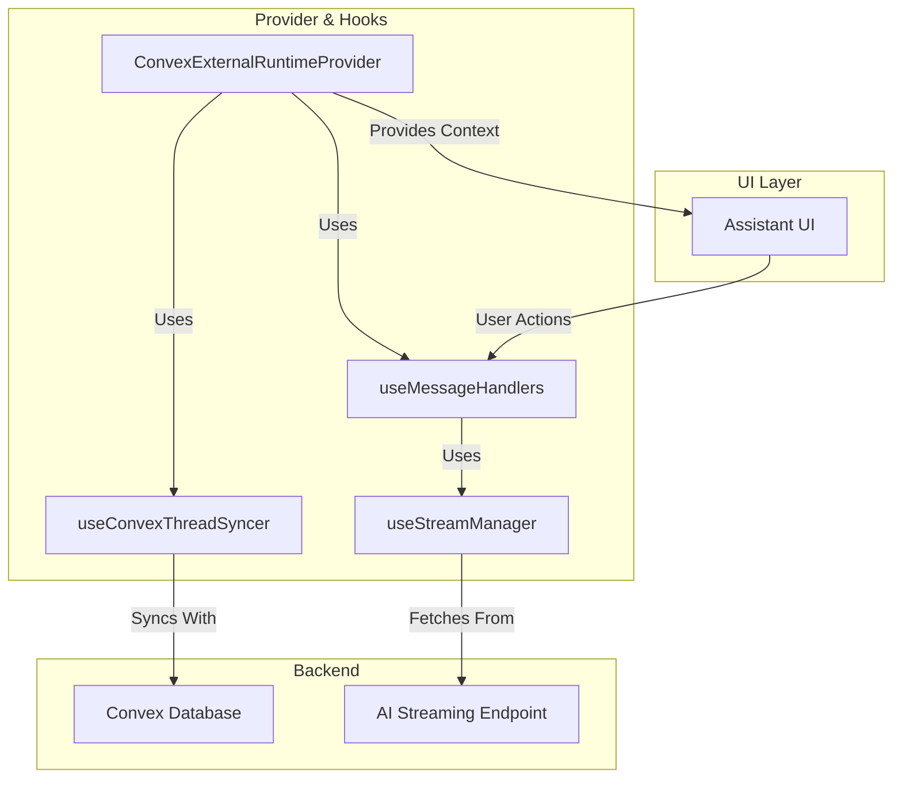

# System Patterns

This document describes the key architectural patterns and design decisions in the AI Chat App.

## Monorepo Architecture

The project has been successfully refactored into an Nx monorepo structure with the following key components:

### Package Structure
- **`app/`**: Main React application with chat interface and authentication
- **`convex/`**: Convex backend functions and schema
- **`packages/ai-agent/`**: Comprehensive AI agent package with Convex integration
- **`packages/models-database/`**: AI model database and utilities
- **`packages/ui/`**: Shared UI components (@anole/ui)
- **`tools/`**: Development tools and utilities

### AI Agent Package Architecture

The `packages/ai-agent` package provides a comprehensive AI agent system:

**Core Components**:
- **Schema Definition**: Tables for threads, messages, streaming data, vector embeddings, files, and API keys
- **Agent Component**: Convex-based agent with multi-model support
- **Client Utilities**: React hooks for thread management and streaming
- **File Management**: Upload, storage, and retrieval capabilities
- **Streaming System**: Real-time message streaming with delta management

**Key Features**:
- **Multi-Model Support**: Gemini 2.5 Pro/Flash/Lite, GPT-4o-mini, Claude-3-5-sonnet
- **Thread Branching**: Parent-child relationships with context merging
- **File Processing**: Support for images and documents
- **Vector Embeddings**: Memory and context management
- **Streaming Deltas**: Efficient real-time updates

## Authentication UX Patterns

The authentication system implements several sophisticated UX patterns to provide a seamless user experience:

### Smart Authentication Flow

**Last Sign-In Method Tracking**:
- **Data Structure**: `LastSignInData` includes `method`, `email`, `socialProvider`, and `timestamp`
- **Persistence**: Stored in localStorage with 30-day expiration
- **Selective Tracking**: Anonymous sign-ins don't overwrite actual user preferences

**Dynamic Form Ordering**:
- **Input Prioritization**: Forms show username field first if last sign-in was username-based
- **Email Pre-filling**: Automatically populates email field with last used email (excluding anonymous)
- **Validation Adaptation**: Form validation schema adapts to preferred input type

### Social Provider Prioritization

**Intelligent Provider Ordering**:
- **Algorithm**: Last used provider (Google, Microsoft, etc.) appears first in the list
- **Dual Support**: Handles both social and generic OAuth providers
- **Preserved Order**: Non-prioritized providers maintain their original configuration order

**Implementation Pattern**:
```typescript
// Order providers based on last used
const orderedProviders = [...providers];
if (lastUsedProvider && orderedProviders.includes(lastUsedProvider)) {
    const lastUsedIndex = orderedProviders.indexOf(lastUsedProvider);
    orderedProviders.splice(lastUsedIndex, 1);
    orderedProviders.unshift(lastUsedProvider);
}
```

### Anonymous Sign-In Protection

**Context Preservation**:
- **Selective Persistence**: Anonymous sign-ins don't overwrite actual user sign-in methods
- **Logical Behavior**: Anonymous authentication treated as temporary, not affecting future flows
- **User Experience**: Maintains user's preferred authentication method after guest sessions

### Component Architecture Pattern

**Modular Authentication Components**:
- **AuthCard**: Main orchestrating component with intelligent ordering logic
- **AuthFormSection**: Handles email/password forms and related buttons
- **SocialSection**: Manages social sign-in buttons and passkey authentication
- **SeparatorSection**: Provides contextual separators between authentication methods

**Benefits**:
- **Reduced Complexity**: Cognitive complexity reduced from 47 to manageable levels
- **Maintainability**: Each section is self-contained and easier to modify
- **Testability**: Components can be tested in isolation
- **Reusability**: Components could be reused elsewhere if needed

### Automatic Guest Access

**Frictionless Guest Experience**:
- **AutoGuestSignIn Component**: Automatically signs in unauthenticated users as guests
- **Background Authentication**: No manual button interaction required
- **Layout Integration**: Seamlessly integrated into chat layout for immediate access

## Backend Architecture: Convex Serverless Platform

The application uses Convex as its comprehensive serverless backend platform, providing:

### Database & Real-time Sync

- **Real-time Database**: Transactional database with reactive queries that automatically update UI
- **Schema Management**: Type-safe schema definitions with migrations support
- **Indexing Strategy**: Optimized indexes for thread searches, user queries, and message retrieval
- **Data Relationships**: Complex relationships between users, threads, messages, pins, and feedback

### Serverless Functions Architecture

- **Queries**: Read-only functions for data fetching (e.g., `getThreads`, `getMessages`)
- **Mutations**: Write operations for data changes (e.g., `sendMessage`, `pinThread`, `updateThreadOrder`)
- **Actions**: Side-effect operations for external API calls (LLM interactions, email sending)
- **HTTP Actions**: Public API endpoints (e.g., `/convex-http/chat/improve-prompt`)
- **Cron Jobs**: Scheduled tasks for maintenance and cleanup operations

### Advanced HTTP Router with Hono

The project integrates Hono for enhanced HTTP endpoint capabilities:

**Hono Integration Pattern** (`convex/http.ts`):

```typescript
// Create Hono app with Convex context
const app: HonoWithConvex<ActionCtx> = new Hono();

// Add middleware
app.use("*", logger());
app.use("*", cors({ /* options */ }));

// Define routes
app.post("/chat/stream", async (c) => {
    return await streamHttpAction(c.env, c.req.raw);
});

// Create HTTP router with Better Auth integration
const http = new HttpRouterWithHono(app);
betterAuthComponent.registerRoutes(http, createAuth);
```

**Enhanced Features**:

- **Dynamic Routing**: Path parameters and complex route patterns
- **Middleware Stack**: Logging, CORS, custom authentication middleware
- **Input Validation**: Built-in request validation capabilities
- **Error Handling**: Structured error responses and custom 404 pages
- **Response Helpers**: JSON formatting, pretty printing, custom headers
- **Dashboard Integration**: Full integration with Convex dashboard for metrics and logging

**Routing Advantages**:

- **Slug Routes**: Support for patterns like `/api/user/:userId`
- **Middleware Composition**: Chainable middleware for cross-cutting concerns
- **Type Safety**: Full TypeScript support with Convex context
- **Better Debugging**: Enhanced logging and error reporting in Convex dashboard

### Authentication Integration

- **Better Auth Integration**: Full-featured authentication via `@convex-dev/better-auth`
- **Session Management**: Secure JWT-based sessions with automatic refresh
- **Multi-Factor Authentication**: TOTP, passkeys, and magic link support
- **Authorization Patterns**: Role-based access control and user-scoped data access

### Last Chat ID Redirect Pattern

**User Experience Continuity**: Seamless return to last active conversation after login

**Database Schema Pattern**:

```typescript
// userSettings table enhancement
userSettings: defineTable({
    userId: v.id("user"),
    lastChatId: v.optional(v.string()),
    // ... other settings
}).index("by_userId", ["userId"])
```

**Backend Functions Pattern**:

```typescript
// Get user's last chat ID
export const getLastChatId = query({
    args: {},
    returns: v.union(v.string(), v.null()),
    handler: async (ctx): Promise<string | null> => {
        const userId = await requireUserId(ctx);
        const userSettings = await ctx.db
            .query("userSettings")
            .withIndex("by_userId", (q) => q.eq("userId", userId))
            .unique();
        return userSettings?.lastChatId ?? null;
    },
});

// Save current chat ID
export const updateLastChatId = mutation({
    args: { chatId: v.string() },
    handler: async (ctx, { chatId }) => {
        const userId = await requireUserId(ctx);
        await updateOrCreateUserSettings(ctx, userId, { lastChatId: chatId });
    },
});
```

**Route Integration Pattern**:

```typescript
// Chat route automatically saves visited chat ID
beforeLoad: async ({ context, params }) => {
    // ... validation logic ...

    // Save last chat ID after validation
    try {
        await context.convexClient.mutation(api.user.functions.updateLastChatId, {
            chatId: params.threadId,
        });
    } catch (error) {
        console.warn("Failed to save last chat ID:", error);
        // Continue loading - non-critical operation
    }
},
```

**Redirect Utility Pattern**:

```typescript
// Reusable redirect logic
export const getAuthRedirectUrl = async (convex: ConvexReactClient): Promise<string> => {
    try {
        const lastChatId = await convex.query(api.user.functions.getLastChatId);

        if (lastChatId) {
            const threadExists = await convex.query(api.chat.functions.validateThreadExists, {
                threadId: lastChatId,
            });

            if (threadExists) {
                return `/chat/${lastChatId}`;
            }
        }
    } catch (error) {
        console.warn("Failed to get last chat ID:", error);
    }

    return "/chat"; // Default fallback
};
```

**Multi-Flow Integration**:

- **Email Login**: Uses redirect utility in success callback
- **Social Login**: Pre-populates callback URL with redirect logic
- **Public Routes**: Redirects authenticated users to last chat
- **Error Resilience**: Graceful fallbacks ensure system reliability

## AI Integration Architecture

### Convex Agent Component Integration

The AI integration is built on the Convex Agent component (`@convex-dev/agent`), providing:

1. **Agent-Centric Architecture**: Unified agent interface with provider-agnostic model support
2. **Automatic Message Persistence**: Built-in message storage with metadata and context tracking
3. **Thread Management**: Native thread creation, continuation, and branching support
4. **File Upload Integration**: Seamless file processing with `getFile()` function
5. **Streaming Architecture**: Direct HTTP streaming with `toDataStreamResponse()`

### Multi-Model Agent System

**Agent Configuration Pattern** (`convex/ai/lib/agents.ts`):

```typescript
export const agents = {
    "gemini-2.5-flash": {
        chat: google.chat("gemini-2.5-flash"),
        instructions: "You are a helpful and efficient assistant...",
        textEmbedding: google.textEmbeddingModel("gemini-embedding-exp-03-07"),
        maxSteps: 8,
        maxRetries: 3,
        contextOptions: { recentMessages: 15 },
    },
    // ... other models
};
```

**Dynamic Model Selection**:

- **Runtime Model Switching**: `getAgent(model)` function for dynamic agent creation
- **Model-Specific Optimization**: Tailored `maxSteps`, `maxRetries`, and context options
- **Provider Diversity**: Google Gemini (primary), OpenAI, Anthropic, OpenRouter support

### Advanced Streaming Architecture

**HTTP Streaming Pattern** (`convex/http.ts` → `convex/chat/functions.ts`):

```
Frontend Request → CORS Router → streamHttpAction → Agent Processing → DataStreamResponse → Frontend Rendering
```

**Streaming Implementation**:

1. **Message Preprocessing**: File attachment processing and content preparation
2. **Agent Interaction**: Thread creation/continuation with user message saving
3. **Streaming Response**: Direct streaming via `thread.streamText({ promptMessageId })`
4. **Async Enhancement**: Scheduled title and summary generation

### Frontend Streaming Architecture

The frontend chat experience is powered by a modular, hook-based architecture designed for performance and maintainability. It ensures a responsive UI through optimistic updates while reliably synchronizing state with the Convex backend.

**Core Hooks & Provider:**

- **`ConvexExternalRuntimeProvider`**: The central provider that orchestrates all chat functionality. It manages the overall state and integrates the various hooks.
- **`useConvexThreadSyncer`**: This hook is responsible for keeping the local message state synchronized with the Convex database. It fetches the message history and includes a crucial guard to prevent optimistic updates from being overwritten by stale database state during a stream.
- **`useMessageHandlers`**: Handles all user-initiated actions, such as sending a new message, editing, or reloading. It is responsible for creating optimistic local updates to make the UI feel instantaneous.
- **`useStreamManager`**: Manages the entire lifecycle of the AI response stream. It handles establishing the connection, processing incoming data chunks with an adaptive throttle, and managing retries and cancellation.

**Architectural Diagram:**



### Thread Management with Branching

**Custom Thread Relationship System**:

- **Parent-Child Relationships**: `threadRelationships` table with branch point tracking
- **Message History Merging**: Intelligent merging of parent and child thread messages
- **Context Preservation**: Maintains conversation context across branches
- **Branch Navigation**: Seamless switching between conversation branches

**Branching Implementation**:

```typescript
// Thread relationship schema
threadRelationships: defineTable({
    parentId: v.optional(v.id("threads")),
    childId: v.id("threads"),
    branchPoint: v.number(), // Message index where branch occurred
    createdAt: v.number(),
}).index("by_parent", ["parentId"]).index("by_child", ["childId"])
```

## Form System Architecture

The project uses an enhanced form system built on TanStack Form with comprehensive validation and accessibility features:

**Form Component Architecture** (`app/src/components/ui/form.tsx`):

```typescript
// Enhanced FormItem with required prop support
interface FormItemProps extends React.ComponentProps<"div"> {
    required?: boolean;
}

// FormLabel with automatic required indicators
interface FormLabelProps extends React.ComponentProps<typeof Label> {
    required?: boolean;
}

// Context-based requirement propagation
const FormItemContext = React.createContext<{
    id: string;
    required?: boolean;
}>({} as FormItemContextValue);
```

**Key Features**:

- **Required Field Indicators**: Automatic visual indicators (*) for required fields
- **Context Propagation**: Required state flows through form hierarchy automatically
- **Accessibility**: Proper ARIA attributes (`aria-required`, `aria-invalid`)
- **Error Display**: Integrated error message display with internationalization
- **Type Safety**: Full TypeScript support with proper prop interfaces

**Usage Patterns**:

```typescript
// Method 1: Set required on FormItem (propagates to children)
<form.AppField name="email">
    {(field) => (
        <field.FormItem required>
            <field.FormLabel>{t`Email`}</field.FormLabel>
            <field.FormControl>
                <Input {...field.props} />
            </field.FormControl>
        </field.FormItem>
    )}
</form.AppField>

// Method 2: Set required directly on FormLabel
<field.FormLabel required>{t`Password`}</field.FormLabel>
```

### Authentication Component Patterns

**Internationalization with @lingui/core/macro**:

All authentication components follow consistent patterns for internationalization:

```typescript
// Standard import pattern
import { t } from "@lingui/core/macro";

// Template literal usage for all user-facing text
const errorMessage = t`Failed to create API key`;
const buttonText = t`Create API Key`;

// Error handling with direct translations
const handleError = (error: unknown) => {
    const message = error instanceof Error ? error.message : t`An unexpected error occurred`;
    toast.error(message);
};
```

**Component Structure Pattern**:

```typescript
interface ComponentProps {
    className?: string;
    classNames?: Record<string, string>;
    // ... other props
}

export const Component = ({ className, classNames, ...props }: ComponentProps) => {
    // Component implementation with consistent patterns
    return (
        <div className={cn("base-styles", className)}>
            {/* Component content */}
        </div>
    );
};
```

## Performance Optimization Patterns

### Adaptive Throttling

**Streaming Performance**:

```typescript
class AdaptiveThrottle {
    private lastExecution = 0;
    private interval = 8; // 8ms ≈ 120fps

    execute(callback: () => void) {
        const now = performance.now();
        if (now - this.lastExecution >= this.interval) {
            callback();
            this.lastExecution = now;
        }
    }
}
```

### Optimistic Updates with Race Condition Protection

**State Synchronization**:

```typescript
// Guard against overwriting optimistic updates
const useConvexThreadSyncer = ({ isRunning }) => {
    const [isSyncPaused, setSyncPaused] = useState(false);

    useEffect(() => {
        if (isRunning) {
            setSyncPaused(true);
        } else {
            // Resume sync after delay to allow optimistic updates to complete
            setTimeout(() => setSyncPaused(false), 2000);
        }
    }, [isRunning]);

    // Skip database sync when paused
    const shouldSkip = isSyncPaused || currentThreadId === "default";
};
```

## Error Handling Patterns

### Comprehensive Error Boundaries

**Global Error Boundary**:

```typescript
export const GlobalErrorBoundaryProvider = ({ children }) => {
    return (
        <ErrorBoundary
            fallback={({ error, resetError }) => (
                <ErrorFallback error={error} resetError={resetError} />
            )}
        >
            {children}
        </ErrorBoundary>
    );
};
```

**Async Error Boundary**:

```typescript
export const AsyncErrorBoundary = ({ children, fallback }) => {
    return (
        <Suspense fallback={<LoadingSpinner />}>
            <ErrorBoundary fallback={fallback}>
                {children}
            </ErrorBoundary>
        </Suspense>
    );
};
```

### Graceful Degradation

**Feature Detection**:

```typescript
// Check for feature support before using
const supportsWebAuthn = window.PublicKeyCredential !== undefined;
const supportsFileSystem = 'showOpenFilePicker' in window;

// Provide fallbacks for unsupported features
const handleFileUpload = async () => {
    if (supportsFileSystem) {
        return await showOpenFilePicker();
    } else {
        // Fallback to traditional file input
        return await fallbackFileUpload();
    }
};
```

## Development Patterns

### Comprehensive Logging

**Scoped Logging System**:

```typescript
import { createLogger } from "@visulima/pail";

export const providerLogger = createLogger({
    name: "chat-provider",
    level: import.meta.env.VITE_DEBUG ? "debug" : "info",
});

// Usage throughout the application
providerLogger.info("[Provider] Thread ID changed", { oldId, newId });
providerLogger.debug("[Handlers] Message sent", { threadId, messageId });
providerLogger.error("[Stream] Connection failed", { error: error.message });
```

### Type Safety Patterns

**Strict TypeScript Configuration**:

```json
{
    "compilerOptions": {
        "strict": true,
        "noUncheckedIndexedAccess": true,
        "exactOptionalPropertyTypes": true,
        "noImplicitReturns": true
    }
}
```

**Runtime Validation**:

```typescript
// Zod schemas for runtime validation
const userSchema = z.object({
    id: z.string(),
    email: z.string().email(),
    name: z.string().min(1),
});

// Validate data at runtime
const validateUser = (data: unknown) => {
    return userSchema.parse(data);
};
```

## Testing Patterns

### Component Testing

**React Testing Library Integration**:

```typescript
import { render, screen, fireEvent } from "@testing-library/react";
import { describe, it, expect } from "vitest";

describe("AuthForm", () => {
    it("should handle sign in", async () => {
        render(<AuthForm view="SIGN_IN" />);

        const emailInput = screen.getByLabelText(/email/i);
        const passwordInput = screen.getByLabelText(/password/i);
        const submitButton = screen.getByRole("button", { name: /sign in/i });

        fireEvent.change(emailInput, { target: { value: "test@example.com" } });
        fireEvent.change(passwordInput, { target: { value: "password123" } });
        fireEvent.click(submitButton);

        await screen.findByText(/signing in/i);
    });
});
```

### Integration Testing

**Convex Function Testing**:

```typescript
import { runQuery, runMutation } from "convex-test";
import { api } from "./_generated/api";

describe("Chat Functions", () => {
    it("should create a new thread", async () => {
        const threadId = await runMutation(api.chat.functions.createThread, {
            model: "gemini-2.5-flash",
        });

        expect(threadId).toBeDefined();

        const thread = await runQuery(api.chat.functions.getThread, { threadId });
        expect(thread).toBeDefined();
        expect(thread.model).toBe("gemini-2.5-flash");
    });
});
```
