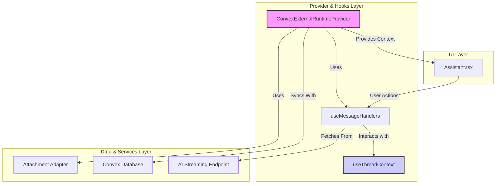

# Chat Feature Architecture

This document provides a high-level overview of the AI chat feature, explaining how its different components work together to deliver a real-time, performant, and reliable user experience.

## Architecture Diagram

The chat feature is built on a modular architecture that separates UI, state management, and data synchronization.

## Core Concepts

- **Centralized State**: The `ConvexExternalRuntimeProvider` is the heart of the feature. It orchestrates the message handlers and provides the final, synchronized state to the UI components. It also directly manages fetching and syncing data with the Convex database.
- **Optimistic Updates**: When a user sends a message, the UI is updated instantly ("optimistically") before the server confirms the action. This makes the application feel incredibly fast.
- **Hook-Based Logic**: Core message creation and streaming logic is encapsulated in the `useMessageHandlers` hook, keeping the provider component cleaner.
- **Resilient Streaming**: The `useMessageHandlers` hook handles all the complexities of streaming AI responses, including connection recovery and adaptive throttling to ensure smooth rendering.

## Directory Structure

-   `components/`: Contains all React components responsible for rendering the chat UI. The main component is `Assistant.tsx`, which brings together the message list, input bar, and other UI elements.
-   `providers/`: This is the brain of the feature. It contains the main provider, the `useMessageHandlers` hook that manages all the core logic, and the type definitions.
-   `adapter/`: Contains adapters that allow the chat feature to interact with other parts of the application, such as the `ConvexAttachmentAdapter` for handling file uploads.

## How It Works: The Lifecycle of a Message

1.  **User Input**: The user types a message into the `Assistant.tsx` component and hits send.
2.  **Action Handling**: The `onNew` event is triggered, calling `handleNewMessage` from the `useMessageHandlers` hook.
3.  **Optimistic UI Update**: `useMessageHandlers` immediately adds the new user message and a blank assistant placeholder to the local state via `useThreadContext`. The UI re-renders instantly.
4.  **Streaming Initiated**: `handleNewMessage` then calls its internal `streamMessage` function to connect to the AI endpoint.
5.  **AI Response Streamed**: As chunks of text arrive from the backend, the `streamMessage` function updates the placeholder message's content in real-time. The `AdaptiveThrottle` ensures these updates are rendered smoothly without lagging the UI.
6.  **Database Synchronization**: The `ConvexExternalRuntimeProvider` uses the `useThreadMessages` hook from Convex to listen for database changes. Its internal logic prevents it from overwriting the local state with stale database data while optimistic updates are in progress.
7.  **Final Sync**: Once the stream is complete and the new messages have been saved to the database, the provider's `useThreadMessages` hook receives the final, canonical state from Convex and updates the local state to ensure perfect consistency.

This entire process ensures the UI is always fast and responsive, while the underlying data is resiliently synchronized with the backend.

For a deeper dive into the provider's internal performance features, see the [Provider README](./providers/README.md).
