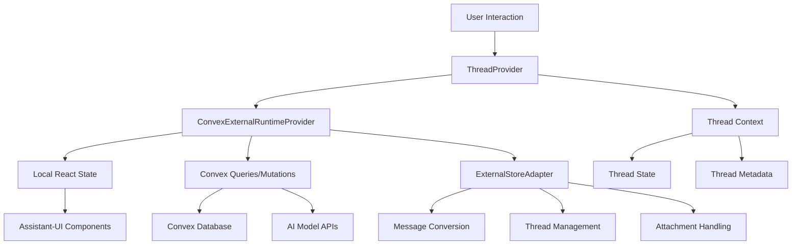

# Convex ExternalStoreRuntime Integration

This directory contains the implementation of Assistant-UI's ExternalStoreRuntime pattern integrated with Convex backend services.

## Overview

The `ConvexExternalRuntimeProvider` follows the ExternalStoreRuntime pattern from Assistant-UI documentation, providing:

- **Full control over message state** - Messages are managed locally with Convex synchronization
- **Optimistic updates** - Immediate UI feedback with background persistence
- **Real-time streaming** - Progressive response updates during AI generation
- **Thread management** - Multi-conversation support with archiving and switching
- **Thread branching** - Create conversation branches from any message to explore different paths
- **Visual tree navigation** - Hierarchical view of conversation branches with interactive navigation
- **File attachments** - Document upload and processing capabilities
- **Message editing** - Edit and regenerate message functionality
- **Centralized thread context** - Dedicated thread state management with ThreadProvider

## Files

### Core Implementation

- `convex-external-runtime-provider.tsx` - Main provider implementing ExternalStoreRuntime with Convex integration
- `thread-context.tsx` - Centralized thread state management with ThreadProvider, useThreadContext hook, and branching support
- `thread-branching-ui.tsx` - UI components for thread branching (tree view, navigation, controls)
- `thread-branching-demo.tsx` - Interactive demo showcasing branching features
- `hooks/use-convex-messages.ts` - Hooks for accessing external store data

### Supporting Files

- `adapter/convex-attachment-adapter.ts` - File attachment handling
- `chat-sidebar.tsx` - Thread list sidebar component

## Usage

### Basic Usage with ThreadProvider

```tsx
import { ConvexExternalRuntimeProvider, ThreadProvider } from "./convex-external-runtime-provider";
import { Thread } from "@assistant-ui/react";

function ChatApp({ threadId }) {
    return (
        <ThreadProvider>
            <ConvexExternalRuntimeProvider model="gemini-1.5-flash" threadId={threadId}>
                <Thread />
            </ConvexExternalRuntimeProvider>
        </ThreadProvider>
    );
}
```

### Alternative Import Pattern

```tsx
import { ConvexExternalRuntimeProvider } from "./convex-external-runtime-provider";
import { ThreadProvider } from "./thread-context";
import { Thread } from "@assistant-ui/react";

function ChatApp({ threadId }) {
    return (
        <ThreadProvider>
            <ConvexExternalRuntimeProvider model="gemini-1.5-flash" threadId={threadId}>
                <Thread />
            </ConvexExternalRuntimeProvider>
        </ThreadProvider>
    );
}
```

### Using Thread Context

```tsx
import { useThreadContext } from "./thread-context";

function ThreadSwitcher() {
    const { currentThreadId, setCurrentThreadId, threads, threadMetadata } = useThreadContext();

    return (
        <div>
            <h3>Current Thread: {currentThreadId}</h3>
            <ul>
                {Array.from(threadMetadata.entries()).map(([id, metadata]) => (
                    <li key={id} onClick={() => setCurrentThreadId(id)}>
                        {metadata.title} ({metadata.status})
                    </li>
                ))}
            </ul>
        </div>
    );
}
```

## Key Features

### 1. State Management

- **Local State**: Messages managed in React state for immediate UI updates
- **Convex Sync**: Background synchronization with Convex database
- **Optimistic Updates**: Instant feedback for user actions
- **Centralized Thread Context**: Dedicated ThreadProvider for thread state management

### 2. Message Handling

- **onNew**: Handles new user messages with streaming responses
- **onEdit**: Enables message editing and regeneration
- **onReload**: Regenerates assistant responses
- **onCancel**: Cancels ongoing streaming requests
- **setMessages**: Enables branch switching and undo functionality

### 3. Thread Management

The implementation uses a dedicated `ThreadProvider` for centralized thread state management:

#### Thread Context Architecture

```tsx
// Centralized thread state in thread-context.tsx
interface ThreadContextType {
    currentThreadId: string;
    setCurrentThreadId: (id: string) => void;
    threads: Map<string, ThreadMessageLike[]>;
    setThreads: React.Dispatch<React.SetStateAction<Map<string, ThreadMessageLike[]>>>;
    threadMetadata: Map<string, { title: string; status: "active" | "archived" }>;
    setThreadMetadata: React.Dispatch<React.SetStateAction<Map<string, { title: string; status: "active" | "archived" }>>>;
}
```

#### Thread Operations

- **Create**: Automatically creates threads in Convex when first message is sent
- **Switch**: Navigate between different conversation threads
- **Rename**: Update thread titles with optimistic updates
- **Archive/Unarchive**: Manage thread status
- **Delete**: Remove threads with proper cleanup
- **Hybrid Management**: Combines Convex persistence with local metadata

#### Usage Patterns

```tsx
// Required: Wrap with ThreadProvider
<ThreadProvider>
    <ConvexExternalRuntimeProvider model={model} threadId={threadId}>
        <Thread />
    </ConvexExternalRuntimeProvider>
</ThreadProvider>
```

### 4. Streaming Support

- **Real-time updates**: Progressive response generation
- **Error handling**: Graceful error display and recovery
- **Cancellation**: Ability to stop generation mid-stream with AbortController
- **Optimistic UI**: Immediate message display with streaming updates

### 5. File Attachments

- **Upload support**: Text files, documents, images
- **Content extraction**: Text extraction from uploaded files
- **Attachment persistence**: Files stored in Convex storage

### 6. Thread Branching

- **Branch Creation**: Create new conversation paths from any message
- **Visual Tree**: Hierarchical view of all conversation branches
- **Branch Navigation**: Breadcrumb navigation and tree-based switching
- **Context Preservation**: Each branch maintains its own message history
- **Branch Management**: Rename, merge, and delete branches
- **Interactive Demo**: Comprehensive demo showcasing all branching features

#### Branching Usage

```tsx
import { useThreadContext } from "./thread-context";
import { BranchTreeView, BranchNavigation } from "./thread-branching-ui";

function BranchingInterface() {
    const { createBranch, switchToBranch, getBranchTree } = useThreadContext();

    // Create a branch from message index 3 with custom name
    const handleCreateBranch = () => {
        const branchId = createBranch(currentThreadId, 3, "Alternative Approach");
        switchToBranch(branchId);
    };

    return (
        <div>
            <BranchNavigation />
            <BranchTreeView />
            <button onClick={handleCreateBranch}>Create Branch</button>
        </div>
    );
}
```

### 7. Convex Integration

- **Thread Creation**: Uses `api.chat.createThread` mutation for proper persistence
- **Message Sync**: Automatic synchronization with Convex database
- **Session Management**: Proper authentication with session tokens
- **Error Handling**: Graceful fallbacks when Convex operations fail

## Architecture



## Implementation Details

### Message Conversion

The provider converts between Convex message format and Assistant-UI's `ThreadMessageLike`:

```tsx
const convertConvexMessage = (message: ConvexMessage): ThreadMessageLike => {
    const role = message.message.role;
    const content = message.message.content;

    let displayContent: string;
    if (typeof content === "string") {
        displayContent = content;
    } else if (Array.isArray(content)) {
        displayContent = content.map((part) => (part.type === "text" ? part.text : `[unsupported content: ${part.type}]`)).join("");
    } else {
        displayContent = "";
    }

    return {
        id: message._id,
        role: role,
        content: [{ type: "text", text: displayContent }],
        createdAt: new Date(message._creationTime),
    };
};
```

### Thread Creation Flow

1. **Local Thread Creation**: Immediate UI response with temporary thread ID
2. **First Message**: Triggers Convex thread creation via `createThread` mutation
3. **ID Synchronization**: Updates local state with Convex-generated thread ID
4. **Navigation Update**: Updates URL to reflect the new thread ID

```tsx
// Detect local thread and create in Convex
if (currentThreadId.startsWith("thread-") && sessionData?.data?.session?.token) {
    const actualThreadId = await createThreadMutation({
        model,
        sessionToken: sessionData.data.session.token,
    });

    // Update local state and navigation
    setCurrentThreadId(actualThreadId);
    navigate({ to: "/chat/$threadId", params: { threadId: actualThreadId }, replace: true });
}
```

### Optimistic Updates

Messages are immediately added to local state, then synchronized with Convex:

```tsx
// Add user message optimistically
setThreads((prev) => {
    const currentThreadMessages = prev.get(actualThreadId) || [];
    return new Map(prev).set(actualThreadId, [...currentThreadMessages, userMessage]);
});

// Stream AI response with real-time updates
await streamMessage(input, actualThreadId);
```

### Error Handling

Comprehensive error handling with graceful degradation:

```tsx
try {
    await streamMessage(input, targetThreadId);
} catch (error) {
    if (error instanceof Error && error.name === "AbortError") {
        console.log("Stream cancelled by user");
        return;
    }

    // Update message with error state
    setThreads((prev) => {
        const updatedMessages = currentThreadMessages.map((m) =>
            m.id === assistantId ? { ...m, content: [{ type: "text" as const, text: `Error: ${error.message}` }] } : m,
        );
        return new Map(prev).set(useThreadId, updatedMessages);
    });
}
```

## Hooks

### useThreadContext

Access thread state and management functions:

```tsx
const { currentThreadId, setCurrentThreadId, threads, setThreads, threadMetadata, setThreadMetadata } = useThreadContext();
```

### useConvexMessages

Access original Convex messages from the runtime:

```tsx
const originalMessages = useConvexMessages();
```

Note: The `useConvexMessageData` hook was removed as it didn't work as expected with the current Assistant UI and Convex agent integration.

## File Structure

```
src/routes/(chat)/-components/
├── convex-external-runtime-provider.tsx  # Main provider implementation
├── thread-context.tsx                    # Thread state management
├── hooks/
│   └── use-convex-messages.ts            # External store hooks
├── adapter/
│   └── convex-attachment-adapter.ts      # File attachment handling
├── chat-sidebar.tsx                      # Thread list UI
└── README.md                             # This documentation
```

## Best Practices

1. **Always use ThreadProvider** - The ConvexExternalRuntimeProvider requires ThreadProvider
2. **Handle async operations** - Thread creation and updates are asynchronous
3. **Use stable references** for handlers to prevent runtime recreation
4. **Handle errors gracefully** with proper user feedback
5. **Implement optimistic updates** for better UX
6. **Use TypeScript** for better development experience
7. **Test streaming scenarios** with network interruptions
8. **Monitor performance** with large message lists

## Migration Guide

To migrate from the original `ConvexRuntimeProvider`:

1. **Update imports and add ThreadProvider**:

```tsx
// Old
import { ConvexRuntimeProvider } from "./convex-runtime-provider";

// New
import { ConvexExternalRuntimeProvider, ThreadProvider } from "./convex-external-runtime-provider";
// Or
import { ConvexExternalRuntimeProvider } from "./convex-external-runtime-provider";
import { ThreadProvider } from "./thread-context";
```

2. **Wrap with ThreadProvider**:

```tsx
// Old
<ConvexRuntimeProvider model={model} threadId={threadId}>
    <Thread />
</ConvexRuntimeProvider>

// New
<ThreadProvider>
    <ConvexExternalRuntimeProvider model={model} threadId={threadId}>
        <Thread />
    </ConvexExternalRuntimeProvider>
</ThreadProvider>
```

3. **Use new thread management hooks**:

```tsx
// New
const { currentThreadId, threads, threadMetadata } = useThreadContext();
```

## Contributing

When making changes:

1. Follow the ExternalStoreRuntime patterns from Assistant-UI docs
2. Maintain TypeScript type safety
3. Add comprehensive error handling
4. Ensure ThreadProvider compatibility
5. Test thread creation and switching flows
6. Update this README with new features

## Troubleshooting

### Common Issues

1. **"useThreadContext must be used within ThreadProvider"**

    - Ensure your component is wrapped with `<ThreadProvider>`

2. **Thread creation fails**

    - Check session token validity
    - Verify Convex mutations are properly configured

3. **Messages not syncing**

    - Check network connectivity
    - Verify Convex queries are running

4. **Streaming interruptions**
    - Implement proper error boundaries
    - Handle AbortController cancellations
